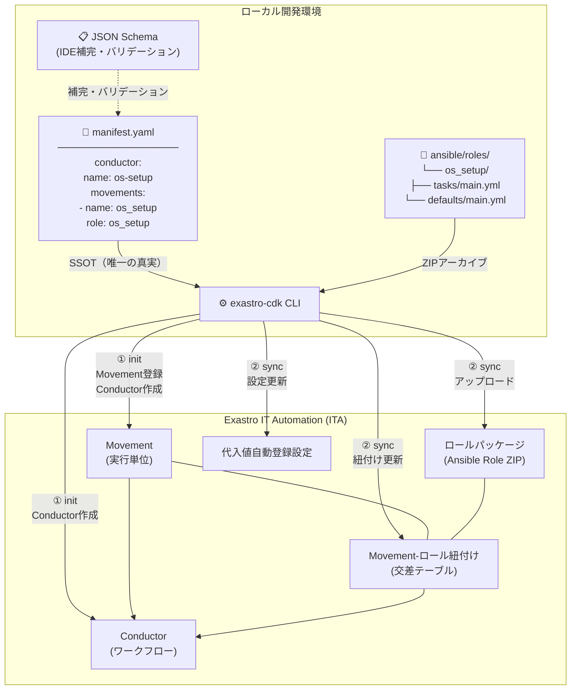
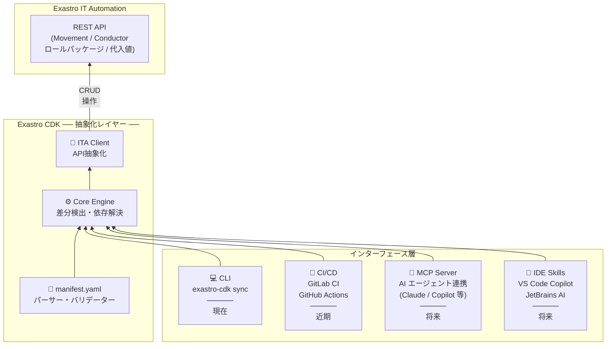

# Exastro CDK (Cloud Development Kit for Exastro)

Exastro CDKは、**Exastro IT Automation (ITA)** の構成管理を「宣言的定義」によって自動化し、**インフラ構築ジョブの作成・管理・運用をコード（IaC）ベースにシフトさせるための開発キット**です。

---

## 0. プロジェクト概要

### 課題

1. 製品を顧客で運用するまでの**デリバリーコスト（SI工数）が多く発生**している。
2. 製品開発部門においても運用環境構築を**自動化・標準化するためのIaCスキルが不足**している。

### 背景

1. ITAにおいてもAPIが柔軟な一方で仕様が複雑であり、不慣れな開発者が直接叩くにはハードルが高い。
2. 結果としてデリバリー面ではWeb UIが前提となり、再現性の低下や作業ミスが多くなる。

### 目的

製品開発部門が自律的に製品と保守運用をセットにした**標準構成（カートリッジ）を開発・提供できる環境を"カートリッジ開発環境（CDK）"として整備**し、保守運用開始までのリードタイムの短縮を図ります。またCDKに**標準Playbookを検索・取り込む機能を追加**し、Playbookの開発コストを低減します。

---

## 1. コンセプト: "Single Source of Truth"

Exastro ITAは非常に強力な自動化プラットフォームですが、画面上の手動操作が介在し構成の再現性や構成管理に課題が生じることがあります。

Exastro CDKは、**`manifest.yaml` を唯一の正解（SSOT）**とし、そこからITA上の「Conductor」「Movement」「ロールパッケージ」「代入値自動登録」を自動生成します。

| 特徴 | 内容 |
| :--- | :--- |
| **シーケンシャル・デザイン** | 複雑な分岐フローを避け、横一列のConductor構成を推奨。テスト容易性と可読性を最大化。 |
| **変数規約の自動適用** | 変数衝突を防ぐため、`role名_変数名` のプレフィックス付与をルール化。 |
| **開発者フレンドリーな抽象化** | `manifest.yaml` に作業リストを書くだけで、Ansible Roleの雛形とITA構成を自動生成。 |
| **Python MVP戦略** | 開発スピード重視でPythonを採用。将来的なGoへの移行を見据えてPydanticで厳密な型定義を実施。 |

### SSOT・ローカル開発環境・ITA環境の関係



### 将来の拡張ビジョン: 抽象化レイヤーとしての Exastro CDK

Exastro CDKのコアエンジン（差分検出・依存解決・API抽象化）は、CLIに限らず様々なインターフェースから呼び出せる**抽象化レイヤー**として設計する。将来的にはMCPサーバーやIDE Skillsへの拡張を想定している。



**拡張の方向性:**

| インターフェース | 概要 |
| :--- | :--- |
| **CLI（現在）** | 開発者が直接実行する `exastro-cdk` コマンド群 |
| **CI/CD（近期）** | GitLab CI / GitHub Actions から `sync` を自動実行 |
| **MCP Server（将来）** | AIエージェント（Claude / Copilot 等）がツールとして呼び出し、自然言語でITAを操作 |
| **IDE Skills（将来）** | VS Code Copilot等のSkillsとして組み込み、エディタ上から直接 `sync` / `diff` を実行 |

---

## 2. クイックスタート

### インストール

Python 3.11 以上が必要です。

```bash
# 仮想環境を作成・有効化（推奨）
python -m venv venv
source venv/bin/activate  # Windows: venv\Scripts\activate

# パッケージをインストール
pip install -e .
```

インストール確認:

```bash
exastro-cdk --help
```

### 環境変数の設定

Exastro ITA への接続情報を環境変数またはプロジェクトルートの `.env` ファイルで設定します。

```bash
# .env ファイルを作成
cat <<EOF > .env
EXASTRO_BASE_URL=https://your-exastro-instance
EXASTRO_REFRESH_TOKEN=your_refresh_token
EXASTRO_ORGANIZATION_ID=your_org_id
EXASTRO_WORKSPACE_ID=your_workspace_id
EOF
```

| 変数名 | 説明 |
| :--- | :--- |
| `EXASTRO_BASE_URL` | Exastro ITA のベースURL |
| `EXASTRO_REFRESH_TOKEN` | ITA のリフレッシュトークン（発行済みであること） |
| `EXASTRO_ORGANIZATION_ID` | 対象オーガナイゼーションID |
| `EXASTRO_WORKSPACE_ID` | 対象ワークスペースID |

### 基本的な使い方

```bash
# 1. manifest.yaml を作成（初回はテンプレートを自動生成）
exastro-cdk init

# 2. manifest.yaml を編集後、Ansible Role 雛形と ITA リソースを登録
exastro-cdk init

# 3. マニフェストの構文チェック
exastro-cdk verify

# 4. ロールパッケージをアップロードして ITA と同期
exastro-cdk sync

# 5. テストシナリオで Conductor/Movement を実行・確認
exastro-cdk test

# 6. ITA 標準カートリッジ（kym）としてパッケージング
exastro-cdk build
```

詳細なユーザーフローは「3. ユーザーフロー」セクションを参照してください。

---

## 3. ユーザーフロー

CLIコマンドの一覧・各コマンドの詳細・開発サイクルは [docs/user_flow.md](docs/user_flow.md) を参照してください。

`init` コマンドの詳細仕様は [docs/specs/init-command.md](docs/specs/init-command.md) を参照してください。

---

## 3. 開発ロードマップ

| フェーズ | 内容 | 詳細 |
| :--- | :--- | :--- |
| **1. Foundation Phase** | `init` コマンド・CLIコア・Schemaドラフト | [docs/01_FoundationPhase/](docs/01_FoundationPhase/README.md) |
| **2. Synchronization Phase** | `sync` コマンド・API通信・差分検出・Pruning（削除） | [docs/02_SynchronizationPhase/](docs/02_SynchronizationPhase/README.md) |
| **3. Advanced Sync & Lifecycle** | `verify` コマンド・Workspace分離・`diff` コマンド | [docs/03_AdvancedSyncAndLifecycleManagementPhase/](docs/03_AdvancedSyncAndLifecycleManagementPhase/README.md) |
| **4. Validation & Test Phase** | `test` コマンド・Validation Engine・CI連携 | [docs/04_ValidationAndTestPhase/](docs/04_ValidationAndTestPhase/README.md) |
| **5. Packaging & Release Phase** | `build` コマンド・`search` コマンド・PyPI公開・ドキュメント整備 | [docs/05_PackagingAndReleasePhase/](docs/05_PackagingAndReleasePhase/README.md) |

現在のフォーカス: **Phase 1 — Foundation Phase**

---

## 4. 利用の前提条件

前提条件・環境変数の設定については [docs/user_flow.md](docs/user_flow.md) を参照してください。

---

## 5. 開発への参加

コーディング規約・ブランチ戦略・レビュープロセス・Linter設定については [docs/contributing.md](docs/contributing.md) を参照してください。

```bash
# 開発環境セットアップ
pip install -e ".[dev]"
pre-commit install
```

---

## 6. ドキュメント構成

```
docs/
├── roadmap.md                              # 開発ロードマップ全体
├── contributing.md                         # コーディング規約・開発ルール
├── user_flow.md                            # ユーザーフロー・ユースケース
├── 01_FoundationPhase/README.md            # Phase 1 詳細
├── 02_SynchronizationPhase/README.md       # Phase 2 詳細
├── 03_AdvancedSyncAndLifecycleManagementPhase/README.md  # Phase 3 詳細
├── 04_ValidationAndTestPhase/README.md     # Phase 4 詳細
├── 05_PackagingAndReleasePhase/README.md   # Phase 5 詳細
└── specs/
    ├── ita-api-reference.md                # ITA APIエンドポイントリファレンス
    └── init-command.md                     # init コマンド仕様
```

---

## 参考資料

- [Exastro ITA 公式APIドキュメント](https://ita-docs.exastro.org/ja/2.7/reference/api/operator/platform-api.html)

